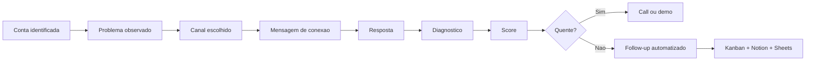

# MAPA MESTRE DE PROSPECCAO - AVRAHAM

**Objetivo:** transformar a base de conhecimento, os prompts e o codigo do sistema em um playbook unico para prospectar com previsibilidade.

---

## 1. O QUE JA EXISTE E COMO USAR

### Documentos de estrategia
- `01_ESTRATEGIA_PROSPECTING_AVRAHAM.md`: define segmentos, canais, scoring macro e ordem de ataque.
- `02_SCRIPTS_ABORDAGEM_CANAIS.md`: biblioteca principal de mensagens por canal e segmento.
- `03_FUNIL_VENDAS_INTEGRADO.md`: desenha a jornada de entrada, qualificacao e roteamento.
- `04_AUTOMACOES_INTELIGENTES.md`: descreve as sequencias de follow-up e o que deve rodar sem intervencao manual.
- `05_DASHBOARD_CENTRAL.md`: mostra como acompanhar o funil em uma unica visao.

### Base institucional
- `17_MASTER_CONTEXT.md`: posicionamento, gargalos e prioridades.
- `04_ICP.md`: criterios de fit, sinais positivos e negativos.
- `05_COMERCIAL.md`: pipeline, campos obrigatorios, abordagem e follow-up.
- `12_PROMPTS.md`: estrutura de prompts para IA.
- `13_TEMPLATES.md`: lista de templates que precisam existir.
- `14_PLAYBOOKS.md`: playbooks por canal que ainda precisam ser detalhados.
- `18_CHECKLIST_MESTRE.md`: controle de pendencias do sistema.

### Sistema operacional
- `AI-cold-outreach/app.py`: dashboard Streamlit com KPIs e acesso rapido aos modulos.
- `AI-cold-outreach/api.py`: API para disparar buscas, consultar leads, status e custos.
- `AI-cold-outreach/batch_run.py`: execucao em lote.
- `AI-cold-outreach/src/prequalify.py`: filtro heuristico antes de gastar LLM.
- `AI-cold-outreach/src/icp.py`: classificador de ICP.
- `AI-cold-outreach/src/scoring.py`: score LLM e geracao de mensagens.
- `AI-cold-outreach/src/gmaps.py`: busca e qualificacao no Google Maps.
- `AI-cold-outreach/src/kanban.py`: source of truth local do pipeline.
- `AI-cold-outreach/src/cost_tracker.py`: custo por busca, token e lead.
- `AI-cold-outreach/prompts/system.py`: regra mestra do comportamento da IA.
- `AI-cold-outreach/prompts/messages.py`: formato das cadencias.
- `AI-cold-outreach/prompts/whatsapp.py`: mensagens curtas para Google Maps e WhatsApp.

---

## 2. PRINCIPIO CENTRAL

A Avraham nao deve prospectar como agencia generica. O sistema deve seguir esta logica:

1. identificar conta com dor real;
2. validar se ha fit com WhatsApp, atendimento, vendas, prospeccao, suporte ou continuidade operacional;
3. priorizar o canal certo;
4. mandar uma mensagem curta e contextual;
5. levar a resposta para diagnostico;
6. qualificar;
7. roteirizar follow-up;
8. registrar tudo no Kanban;
9. automatizar o que for repetitivo;
10. manter o humano apenas no que exige decisao.

---

## 3. QUEM PROSPECTAR

### Critérios positivos
- WhatsApp aparece como canal central.
- Ha volume de contatos ou atendimentos.
- Existe time comercial, suporte ou operacao.
- Ha perda de oportunidade por demora.
- Ha sinais de crescimento, campanha, trafego ou multiplicidade de canais.
- O decisor e acessivel no LinkedIn ou em canais publicos.
- A empresa aparenta ticket suficiente para implantar e manter a solucao.

### Critérios negativos
- Negocio pequeno demais.
- Sem volume.
- Sem dono claro ou responsavel.
- Sem processo minimo.
- Sem capacidade de investimento.
- Sem urgencia.
- Quer "testar IA" sem problema real.

### Prioridade de ICP
1. SaaS e tecnologia.
2. Empresas com prospeccao ativa.
3. E-commerce grande e varejo digital.
4. Industria B2B e distribuidoras.
5. Imobiliario e automotivo.
6. Clinicas e saude com volume.
7. Betting/gambling e operacoes reguladas.

---

## 4. CANAIS E QUANDO USAR

### LinkedIn
Use quando:
- houver decisor claro;
- a empresa tiver estrutura;
- o cargo for acessivel;
- o problema puder ser conectado a vendas, atendimento, qualificação ou reativacao.

Nao usar para:
- micro negocio;
- empresa sem equipe;
- perfil pessoal sem contexto de operacao;
- industria com pouco potencial de recorrencia.

### Google Maps
Use quando:
- o negocio for local ou regional;
- o sinal de volume estiver visivel em avaliacoes, site, WhatsApp, horario de funcionamento ou concorrencia;
- a operacao depender de atendimento rapido.

### Cold Email
Use quando:
- houver lista minimamente limpa;
- o mercado tolerar email frio;
- o objetivo for escala e follow-up automatizado.

### Cold Call
Use quando:
- ja houver indicio de dor;
- o telefone for valido;
- o ticket justificar contato humano.

### Referencia
Use sempre que houver cliente atual, parceiro ou contato quente.

---

## 5. FLUXO PADRAO DE PROSPECCAO

---

## 6. SCORE OPERACIONAL

### Score de fit
- 0 a 30: aderencia ao problema.
- 0 a 40: interesse demonstrado.
- 0 a 30: urgencia e oportunidade.

### Regra de acao
- 80 a 100: contato humano imediato.
- 60 a 79: proposta ou call em ate 24h.
- 40 a 59: sequencia de nurture.
- 20 a 39: nutricao leve e reavaliação.
- Abaixo de 20: arquivar.

### Regra importante
Nenhum lead fica sem proxima acao e data.

---

## 7. O QUE A IA PRECISA RECEBER

Toda geracao deve conter:
- contexto da empresa;
- ICP;
- canal;
- objetivo;
- restricoes;
- linguagem;
- base de cases;
- regra de negocio;
- formato de saida.

### Prompt mestre
O prompt mestre do sistema ja vive em `AI-cold-outreach/prompts/system.py` e injeta o playbook base no modelo.

### Prompt de cadencia
O gerador de mensagens usa `AI-cold-outreach/prompts/messages.py` e devolve:
- conexao;
- pos-aceite;
- diagnostica.

---

## 8. O QUE O CODIGO JA FAZ

### Busca e filtro
- `src/apify_client.py`: busca LinkedIn e Google Maps.
- `src/prequalify.py`: corta lead fraco antes do LLM.
- `src/icp.py`: classifica o segmento.

### Inteligencia
- `src/scoring.py`: calcula score e cria a cadencia.
- `src/language.py`: detecta idioma.
- `src/enrichment.py`: normaliza experiencia e empresa.

### Operacao
- `src/kanban.py`: grava lead, status e historico.
- `src/cost_tracker.py`: acompanha gasto por lead e por busca.
- `src/notion_sync.py`: replica para Notion.
- `src/sheets_sync.py`: replica para Google Sheets.

### Experiencia
- `app.py`: visao rapida da operacao.
- `dashboard/src/*`: interface moderna para exploracao, docs e leads.

---

## 9. ROTINA DE EXECUCAO

### Diario
1. Escolher canal.
2. Separar listas.
3. Rodar busca.
4. Revisar score.
5. Enviar cadencia.
6. Registrar resposta.
7. Atualizar proxima acao.

### Semanal
1. Revisar canal com melhor conversao.
2. Ajustar ICP.
3. Revisar scripts com maior resposta.
4. Revisar custos.
5. Reativar leads mornos.

### Mensal
1. Revisar os segmentos que mais fecham.
2. Remover nichos ruins.
3. Atualizar templates.
4. Atualizar playbook com novos cases.

---

## 10. DECISAO RAPIDA

### Se a conta parece forte
- LinkedIn.
- Mensagem contextual.
- Diagnostico curto.
- Call.

### Se a conta e local
- Google Maps.
- Mensagem curta via WhatsApp.
- Qualificacao rapida.
- Encaminhar para humano.

### Se ha base e escala
- Email + WhatsApp + automacao.

### Se ha urgencia operacional
- Call ou visita.

---

## 11. SAIDA ESPERADA DO SISTEMA

O playbook deve gerar:
- listas priorizadas;
- mensagens prontas;
- cadencias de follow-up;
- registro central;
- automacoes acionadas;
- dashboard de leitura rapida;
- proposta ou diagnostico no momento certo.

---

## 12. PROXIMO NÍVEL

Os proximos artefatos a consolidar sao:
- biblioteca de objeções;
- biblioteca de follow-up;
- biblioteca de cases;
- biblioteca de propostas;
- biblioteca de prompts por segmento;
- painel unico de operacao.

