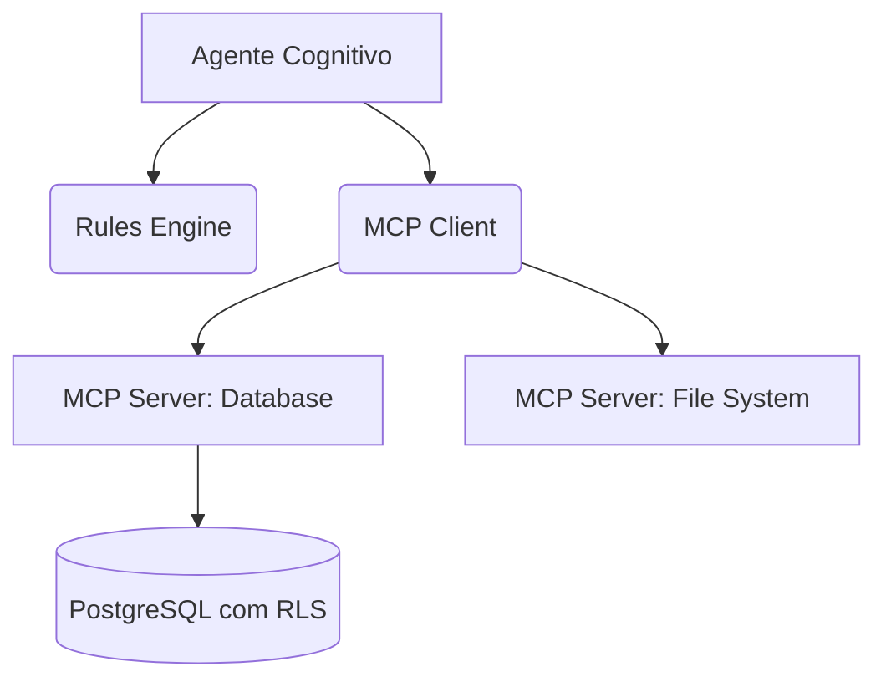
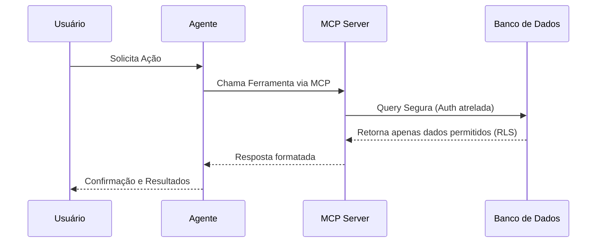

# Mapas Mentais e Grafos de Arquitetura

Esta seção detalha visualmente as interações no Antigravity.

## Grafo de Componentes

```mermaid
graph TD;
    A[Agente Cognitivo] --> B(Rules Engine);
    A --> C(MCP Client);
    C --> D[MCP Server: Database];
    C --> E[MCP Server: File System];
    D --> F[(PostgreSQL com RLS)];
```

## Fluxo de Execução

```mermaid
sequenceDiagram
    participant U as Usuário
    participant A as Agente
    participant M as MCP Server
    participant DB as Banco de Dados

    U->>A: Solicita Ação
    A->>M: Chama Ferramenta via MCP
    M->>DB: Query Segura (Auth atrelada)
    DB-->>M: Retorna apenas dados permitidos (RLS)
    M-->>A: Resposta formatada
    A-->>U: Confirmação e Resultados
```
