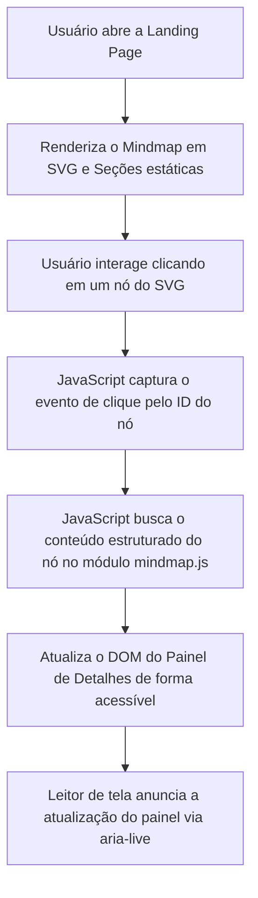

# Especificações Técnicas (Specs) - Landing Page Antigravity

Este documento detalha os fluxos de dados, arquitetura da landing page, estrutura de componentes e regras de acessibilidade aplicadas.

## 1. Arquitetura da Página (Wireframe e Seções)

A página será dividida nas seguintes seções principais:
1. **Cabeçalho (Header)**: Navegação simplificada e seletor de tópicos.
2. **Hero Section**: Título impactante com a proposta de valor do Antigravity, seguido de uma chamada para ação (CTA).
3. **Seção de Exploração Interativa (Mindmap)**:
    - Um painel contendo o gráfico de dependências (Mindmap em SVG interativo).
    - Nós selecionáveis: Agentes, Codes, Rules, MCPs, Stacks, Bancos de Dados, RLS e Cybersecurity.
    - Clicar em um nó atualiza a área de exibição lateral de detalhes.
4. **Painel de Detalhes Dinâmico**: Exibe o conteúdo teórico, trechos de código explicativos e boas práticas sobre o pilar selecionado no Mindmap.
5. **Seção de Boas Práticas**: Tabela comparativa e fluxos de segurança (RLS, cibersegurança).
6. **Rodapé (Footer)**: Links institucionais e validação de acessibilidade.

## 2. Fluxo de Dados e Interações

O fluxo de dados é local e orientado a eventos no frontend.



## 3. Modelo de Dados (Estrutura de Nós)

O módulo `src/js/mindmap.js` irá expor uma estrutura de dados representando os nós do Mindmap:

```javascript
const nosConceituais = {
  agentes: {
    titulo: "Agentes Cognitivos",
    descricao: "Unidades autônomas que executam tarefas baseadas em instruções e contexto.",
    boasPraticas: [
      "Definição de objetivos claros no sistema de prompt",
      "Restrição de escopo de ação para evitar loops infinitos"
    ]
  },
  // Outros nós...
};
```

## 4. Requisitos de Acessibilidade (WCAG 2.1 AA)

- **Aria-Live**: O painel de detalhes dinâmicos usará `aria-live="polite"` para notificar leitores de tela quando um novo pilar for selecionado.
- **Navegação Teclado**: Cada nó do mindmap será representável por um elemento `<button>` ou `<a>` dentro do SVG com `tabindex="0"`, permitindo ativação via teclas Enter ou Space.
- **Contraste**: Todos os textos seguem as cores especificadas em `design-tokens.json`, mantendo contraste acima de 4.5:1.
