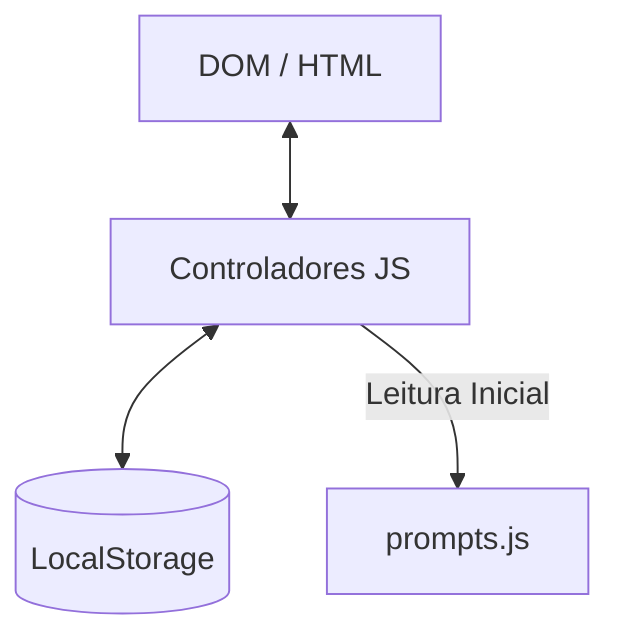

# Especificações Técnicas (SPECS)

## 1. Dados e Estrutura (Schemas)

A estrutura base de um "Prompt" dentro de `data/prompts.json` e `js/prompts.js` seguirá a seguinte interface:

```json
{
  "id": "uuid-v4",
  "title": "Nome descritivo",
  "description": "Breve explicação do prompt e seu objetivo",
  "content": "Conteúdo exato a ser copiado para o LLM",
  "platform": "ChatGPT | Claude | Gemini | Geral",
  "application": "Código | Escrita | Análise | Imagem",
  "type": "Zero-shot | Few-shot | Chain-of-Thought",
  "isCustom": boolean,
  "createdAt": "ISOString"
}
```

## 2. Endpoints e APIs
O projeto não consome APIs externas e não possui endpoints REST. Todo o carregamento é estático e local.

## 3. Fluxos de Dados
- **Carregamento Inicial:** `index.html` carrega `styles.css` e o script principal. A lista padrão de prompts embutida (`js/prompts.js`) é fundida com a lista local gravada no `LocalStorage` e renderizada na DOM.
- **Busca / Filtro:** Ao alterar o input de texto ou os selects, o JavaScript processa os arrays em memória utilizando `Array.prototype.filter()` e invoca o redesenho da UI.
- **Favoritos:** Ao clicar no ícone de estrela/favorito, a função insere o `id` do prompt na chave `avraham_favorites` no LocalStorage e atualiza o estado visual do ícone correspondente.
- **Importação/Exportação:** Exportar gera um objeto Blob formato JSON no navegador e chama o download. Importar usa a File API nativa e faz o merge seguro da chave e ID.

## 4. Diagrama de Arquitetura Simplificado
A arquitetura é dividida em Modelo (LocalStorage e JSON embutido), Visão (DOM e CSS) e Controlador (Vanilla JS).


